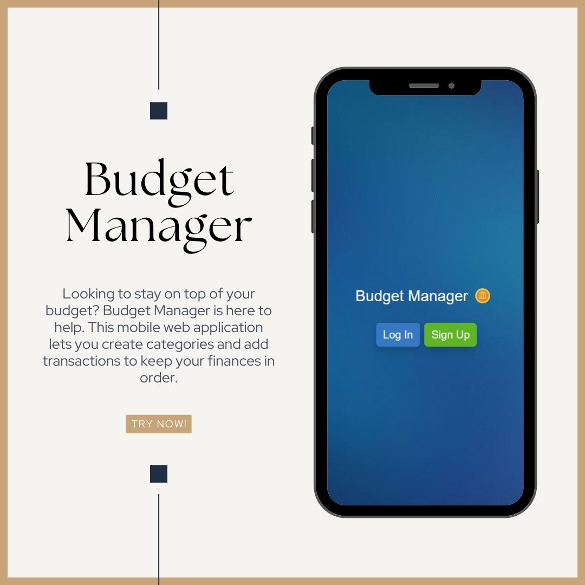

<a name="readme-top"></a>

<div align="center">
  
  <br/>
</div>

<!-- TABLE OF CONTENTS -->

# 📗 Table of Contents

- [📗 Table of Contents](#-table-of-contents)
- [📖 Budget Manager ](#-budget-manager-)
  - [🛠 Built With ](#-built-with-)
    - [Tech Stack ](#tech-stack-)
    - [Key Features ](#key-features-)
  - [🚀 Live Demo ](#-live-demo-)
  - [💻 Getting Started ](#-getting-started-)
    - [Prerequisites](#prerequisites)
    - [Setup](#setup)
    - [Install](#install)
    - [Usage](#usage)
    - [Run tests](#run-tests)
    - [Deployment](#deployment)
  - [👥 Authors ](#-authors-)
  - [🔭 Future Features ](#-future-features-)
  - [🤝 Contributing ](#-contributing-)
  - [⭐️ Show your support ](#️-show-your-support-)
  - [🙏 Acknowledgments ](#-acknowledgments-)
  - [📝 License ](#-license-)

<!-- PROJECT DESCRIPTION -->

# 📖 Budget Manager <a name="Budget Manager"></a>

Looking to stay on top of your budget? **Budget Manager** is here to help. This mobile web application lets you create categories and add transactions to keep your finances in order.

<div align="center"></div>


## 🛠 Built With <a name="built-with"></a>

### Tech Stack <a name="tech-stack"></a>

<details>
  <summary>Server</summary>
  <ul>
    <li><a href="https://rubyonrails.org/">Ruby on Rails</a></li>
  </ul>
</details>

<details>
<summary>Database</summary>
  <ul>
    <li><a href="https://www.postgresql.org/">PostgreSQL</a></li>
  </ul>
</details>

<!-- Features -->

### Key Features <a name="key-features"></a>
- **User Authentication with devise**
- Bootstrap5 has been used for styling!

<p align="right">(<a href="#readme-top">back to top</a>)</p>

<!-- LIVE DEMO -->

## 🚀 Live Demo <a name="live-demo"></a>

- [Live Demo Link]()

<p align="right">(<a href="#readme-top">back to top</a>)</p>

<!-- GETTING STARTED -->

## 💻 Getting Started <a name="getting-started"></a>

To get a local copy up and running, follow these steps.

### Prerequisites

In order to run this project you need:

- Ruby runtime environment
- Postgresql
- Rails

### Setup

Clone this repository to your desired folder:

### Install

Install this project with:

- Clone the repository using `https://github.com/developerwaleed/Budget-Manager.git`
- Navigate to the folder using `cd Budget-Manager`
- Use the following commands to
    - install necessary gems `bundle install`
    - create database `rails db:create`
    - run migrations and create default user as admin `rails db:migrate db:seed` 

### Usage

To run the project, execute the following command:

```sh
 rails s
```


### Run tests

To run tests, run the following command:

```sh
rspec spec
```

### Deployment

You can deploy this project using:
 - Heroku

<p align="right">(<a href="#readme-top">back to top</a>)</p>


## 👥 Authors <a name="author"></a>

| 👤 Name | Github | Twitter | LinkedIn |
|------|--------|---------|----------|
|Waleed Amjad|[@developerwaleed](https://github.com/developerwaleed)|[@developerwaleed](https://twitter.com/developerwaleed)|[@developerwaleed](https://www.linkedin.com/in/developerwaleed/)|


## 🔭 Future Features <a name="future-features"></a>

 - Allow users to add their avatar.
 - Create API endpoints to allow users to update their info. 

<p align="right">(<a href="#readme-top">back to top</a>)</p>

<!-- CONTRIBUTING -->

## 🤝 Contributing <a name="contributing"></a>

Contributions, issues, and feature requests are welcome!

Feel free to check the [issues page](../../issues/).

<p align="right">(<a href="#readme-top">back to top</a>)</p>

<!-- SUPPORT -->

## ⭐️ Show your support <a name="support"></a>

If you like this project...

<p align="right">(<a href="#readme-top">back to top</a>)</p>

<!-- ACKNOWLEDGEMENTS -->

## 🙏 Acknowledgments <a name="acknowledgements"></a>

 We would like to thank microverse for providing the curriculum to guide us on this project.

<p align="right">(<a href="#readme-top">back to top</a>)</p>

<!-- LICENSE -->

## 📝 License <a name="license"></a>

This project is [MIT](https://github.com/developerwaleed/final-capstone-back-end/blob/fixes/MIT.md) licensed.

<p align="right">(<a href="#readme-top">back to top</a>)</p>
